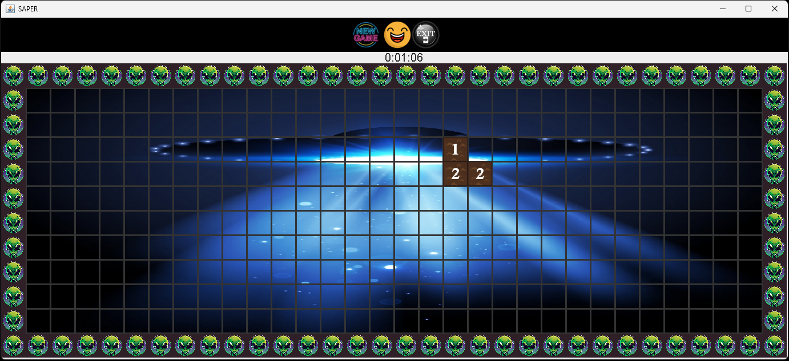
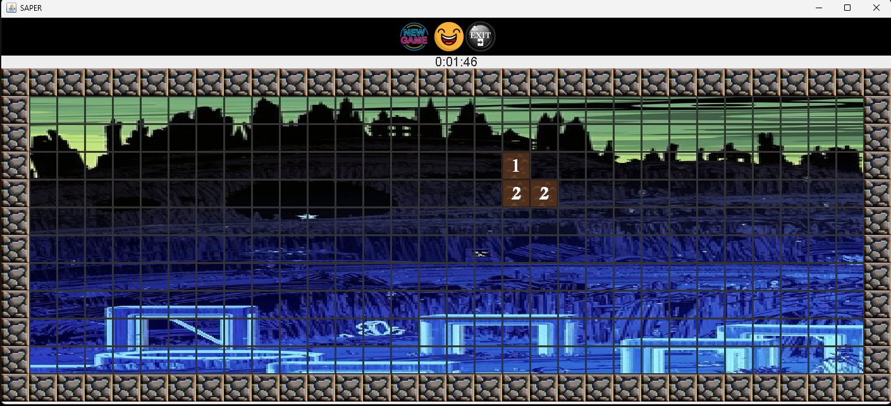
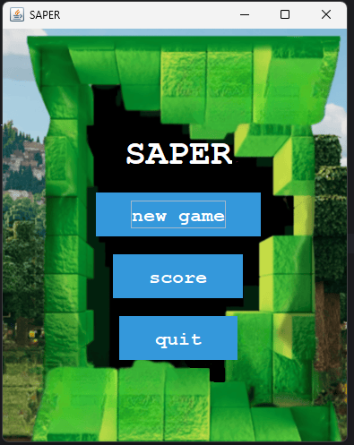
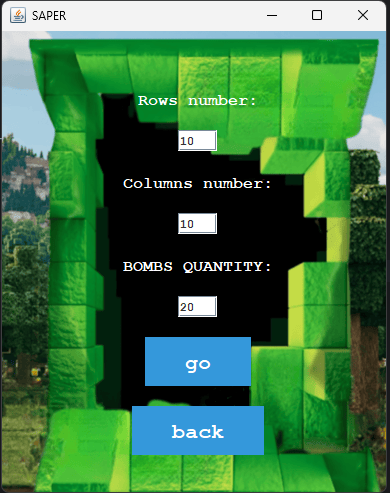

# SAPER (Minesweeper) 👾💣

**SAPER** is my version of the classic **Minesweeper** game written in **Java (Swing)**.
It includes extra features like multiple themes, custom board settings, and a score table.

---

## Key Features

* 🎮 Classic Minesweeper gameplay
  reveal cells, avoid bombs, and use numbers to identify how many bombs are nearby

* ⚙️ Custom game setup
  choose:

  * number of **rows**
  * number of **columns**
  * **bomb count**

* 🎨 Themes & visual options

  * multiple background themes (e.g., Galaxy / Forest / City / UFO)
  * adjustable cell size

* 🏆 Scores / leaderboard

  * saving and displaying best results
  * the score list is kept sorted using a **tree-based data structure**

* ⏱️ Game timer

  * visible timer during gameplay

---

## Screenshots

> Tip: put images in an `assets/` folder and keep the paths like below.

### Gameplay (different themes)

### Menu & board settings

### Options (themes / cell size)

---

## Controls

* **Left mouse button** – reveal a cell
* **Right mouse button** – flag/unflag a bomb
* **New Game** – start a new game
* **Score** – show the leaderboard
* **Exit / Quit** – close the game

---

## How to run

### IntelliJ IDEA

1. Open the project in IntelliJ IDEA.
2. Set the JDK (e.g., **17** or the version you use).
3. Run the main entry class (e.g., `Main` / `App`).

### Command line (optional)

If this is a plain Swing project without Maven/Gradle, running from the IDE is enough.
If you use a build tool, add the proper commands here.

---

## Data files (if present)

The project may generate or use files such as:

* `score.csv` – leaderboard data
* `save.ser` – saved state (serialization)
* `config.txt` – configuration/settings

---

## Author

**Dominik (dominikoka)
